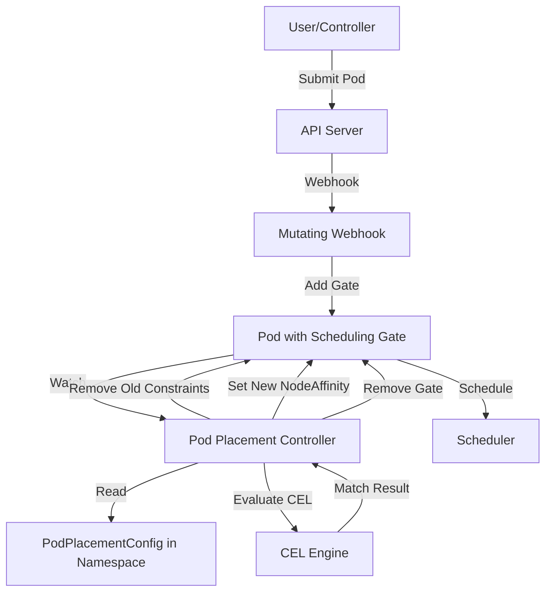

# CEL Architecture Placement Plugin

## Release Signoff Checklist

- [ ] Enhancement is `implementable`
- [ ] Design details are appropriately documented from clear requirements
- [ ] Test plan is defined
- [ ] Graduation criteria for dev preview, tech preview, GA
- [ ] User-facing documentation is created in [openshift-docs](https://github.com/openshift/openshift-docs/)

## Summary

This enhancement proposes a new plugin called `celArchitecturePlacement` for the Multiarch Tuning Operator (MTO) that enables fine-grained control over pod architecture placement using Common Expression Language (CEL) expressions. The plugin is available exclusively in namespace-scoped [`PodPlacementConfig`](../../api/v1beta1/podplacementconfig_types.go) resources, allowing administrators to define rules that evaluate Pod metadata and automatically adjust the target architecture based on matching criteria. When a rule matches, the plugin removes any existing architecture constraints from the pod's nodeSelector and nodeAffinity, then sets a list of allowed architectures. This approach provides a declarative and image independent architecture that goes beyond the current image-based architecture detection.

## Motivation

The current Multiarch Tuning Operator automatically determines Pod image architecture compatibility by inspecting container images. While this works well for most scenarios, there are cases where administrators need more control at the namespace level:

1. **Workload-specific architecture preferences** Some workloads may benefit from specific architectures based on their component affinnity (e.g., database pods on ppc64le, web servers on amd64)
2. **Operator namespace support** Operators running in a shared namespace, such as `openshift-operators` or other shared namespaces may need architecture-specific placement rules that influence the operands subsequent architecture.
3. **Override image-based detection** In some cases, administrators may want to override the architecture determined by image inspection, especially when using multi-arch images or when the image architecture is not the desired runtime architecture.

### User Stories

- As a platform engineer, I want to override pod placement behavior to specific architectures without modifying the underlying application.
- As a namespace administrator, I want to use well-known Kubernetes labels (like `app.kubernetes.io/component`) to determine architecture placement for different application tiers in my namespace, tuning any architecture constraints.

### Goals

- Enable fine-grained control over Pod placement based on a Pod's spec
- Provide a flexible, CEL-based rule engine for Pod identification and when identified place Pods specifically in a multi-arch compute environment
- Support namespace-scoped architecture rules using a new plugin in `PodPlacementConfig`
- Remove existing architecture constraints and set new ones when rules match
- Maintain compatibility with existing MTO functionality
- Limit the explosion of rules by requiring a default architecture list
- Support operator namespaces including `openshift-operators`

### Non-Goals

- Provide cluster-wide architecture rules
- Replace the existing image-based architecture detection mechanism entirely
- Provide runtime architecture switching for already-scheduled pods
- Support CEL expressions on resources other than Pods
- Automatically detect optimal architecture for workloads
- Preserve existing architecture constraints when rules match (they are explicitly removed)

## Proposal

We propose introducing a new plugin called `celArchitecturePlacement` that can be configured in [`PodPlacementConfig`](../../api/v1beta1/podplacementconfig_types.go) (namespace-scoped) resources. This design choice ensures that architecture rules are applied at the namespace level with established control boundaries for multi-tenant applications (operators that install multiple times into different namespaces).

### Workflow Description

#### Configuration

1. The namespace administrator creates or updates a `PodPlacementConfig` resource in their namespace with the `celArchitecturePlacement` plugin enabled
2. The administrator defines:
   - A list of default architectures (required, e.g., `[ppc64le, amd64]`)
   - One or more `ArchitectureRule` objects, each containing:
     - A name for the rule
     - A CEL expression that evaluates against Pod resources
     - A target architecture list to apply when the expression matches

#### Pod Admission and Processing

1. A pod is submitted to the API server in a namespace with a `PodPlacementConfig` containing `celArchitecturePlacement`
2. The MTO mutating webhook adds a scheduling gate (existing behavior)
3. The Pod Placement Controller processes the pod:
   - Retrieves all `PodPlacementConfig` resources in the pod's namespace
   - Filters configs whose `labelSelector` matches the pod
   - For matching configs with `celArchitecturePlacement` enabled, evaluates CEL expressions in priority order
   - If a rule matches (CEL expression returns `true`):
     - **Removes any existing architecture constraints** from the pod's `spec.nodeSelector` (removes `kubernetes.io/arch` key if present)
     - **Removes any existing architecture-based node affinity** from the pod's `spec.affinity.nodeAffinity` (removes node selector terms with `kubernetes.io/arch` match expressions)
     - **Sets new node affinity** with the rule's target architecture list
   - If no rules match, uses the default architecture list specified in the plugin configuration (also removing existing constraints)
   - The scheduling gate is removed

#### Architecture Constraint Removal

When the plugin applies architecture rules, it performs the following operations:

1. **NodeSelector Cleanup** Removes the `kubernetes.io/arch` key from `spec.nodeSelector` if present
2. **NodeAffinity Cleanup** Removes any `matchExpressions` with key `kubernetes.io/arch` from all node selector terms in `spec.affinity.nodeAffinity.requiredDuringSchedulingIgnoredDuringExecution`. `preferredDuringSchedulingIgnoredDuringExecution` would be untouched.
3. **New Affinity Application** Adds new node affinity requirements with the target architecture list

This ensures that the plugin's architecture selection takes precedence over any existing constraints, whether they were set by:

- User-defined node selectors
- Other controllers or operators
- Previous MTO processing
- Image-based architecture detection

#### Example: PodPlacementConfig

The example sets a default architecture for amd64, and a selection of a matching Pods to place on ppc64le and another rule to place on amd64 or arm64.

```yaml
apiVersion: multiarch.openshift.io/v1beta1
kind: PodPlacementConfig
metadata:
  name: database-rules
  namespace: production
spec:
  labelSelector:
    matchLabels:
      tier: database
  plugins:
    celArchitecturePlacement:
      enabled: true
      defaultArchitectures:
        - amd64
      rules:
        - name: postgres-on-ppc64le
          expression: |
            self.metadata.labels.exists(l, l.key == 'app.kubernetes.io/component' && l.value == 'database') &&
            self.metadata.labels.exists(l, l.key == 'app.kubernetes.io/part-of' && l.value == 'postgresql')
          architectures:
            - ppc64le
        - name: redis-on-amd64-and-arm64
          expression: |
            self.metadata.name.startsWith('redis-')
          architectures:
            - amd64
            - arm64
```

**Before plugin processing** 

A Pod with existing architecture constraint is shown:

```yaml
apiVersion: v1
kind: Pod
metadata:
  name: postgres-db
  labels:
    app.kubernetes.io/component: database
    app.kubernetes.io/part-of: postgresql
spec:
  nodeSelector:
    kubernetes.io/arch: amd64  # Existing constraint
  containers:
  - name: postgres
    image: postgres:latest
```

**After plugin processing** 

The existing constraint is removed, and the new constraint applied)

```yaml
apiVersion: v1
kind: Pod
metadata:
  name: postgres-db
  labels:
    app.kubernetes.io/component: database
    app.kubernetes.io/part-of: postgresql
spec:
  # nodeSelector.kubernetes.io/arch removed
  affinity:
    nodeAffinity:
      requiredDuringSchedulingIgnoredDuringExecution:
        nodeSelectorTerms:
        - matchExpressions:
          - key: kubernetes.io/arch
            operator: In
            values:
            - ppc64le  # New constraint from rule
  containers:
  - name: postgres
    image: postgres:latest
```

### API Extensions

#### Changes to PodPlacementConfig

The [`PodPlacementConfig`](../../api/v1beta1/podplacementconfig_types.go) CRD will be extended to support the new `celArchitecturePlacement` plugin in the `LocalPlugins` struct:

```go
// LocalPlugins represents the plugins configuration for podplacementconfigs resource.
type LocalPlugins struct {
    NodeAffinityScoring *NodeAffinityScoring `json:"nodeAffinityScoring,omitempty"`
    celArchitecturePlacement *celArchitecturePlacement `json:"celArchitecturePlacement,omitempty"`
}
```

**Note** The `celArchitecturePlacement` plugin is exclusively namespace-scoped and is **not** added to the `Plugins` struct in [`ClusterPodPlacementConfig`](../../api/v1beta1/clusterpodplacementconfig_types.go).

#### celArchitecturePlacement Plugin Definition

A plugin definition will be added to [`api/common/plugins/`](../../api/common/plugins/):

```go
const (
    // celArchitecturePlacementPluginName stores the name for the celArchitecturePlacement plugin.
    celArchitecturePlacementPluginName = "celArchitecturePlacement"
)

// celArchitecturePlacement is a plugin that provides CEL-based architecture selection rules.
// This plugin is only available in namespace-scoped PodPlacementConfig resources.
// When a rule matches, the plugin removes any existing architecture constraints from the pod's
// nodeSelector and nodeAffinity, then sets new architecture constraints based on the rule.
type celArchitecturePlacement struct {
    BasePlugin `json:",inline"`
    
    // DefaultArchitectures is a required list of architectures to use when no rules match.
    // This limits the explosion of possible rules by providing a sensible default.
    // When applied, existing architecture constraints are removed and replaced with these architectures.
    // +kubebuilder:validation:Required
    // +kubebuilder:validation:MinItems=1
    // +kubebuilder:validation:MaxItems=4
    DefaultArchitectures []string `json:"defaultArchitectures" protobuf:"bytes,2,rep,name=defaultArchitectures"`
    
    // Rules is a list of architecture selection rules evaluated in order.
    // The first matching rule determines the target architecture.
    // When a rule matches, existing architecture constraints are removed and replaced.
    // +optional
    // +kubebuilder:validation:MaxItems=50
    Rules []ArchitectureRule `json:"rules,omitempty" protobuf:"bytes,3,rep,name=rules"`
}

// ArchitectureRule defines a single CEL-based rule for architecture selection
type ArchitectureRule struct {
    // Name is a descriptive name for this rule
    // +kubebuilder:validation:Required
    // +kubebuilder:validation:MinLength=1
    // +kubebuilder:validation:MaxLength=253
    Name string `json:"name" protobuf:"bytes,1,opt,name=name"`
    
    // Expression is a CEL expression that evaluates against a Pod resource.
    // The expression must return a boolean value.
    // The expression has access to the pod via the 'self' variable.
    // +kubebuilder:validation:Required
    // +kubebuilder:validation:MinLength=1
    Expression string `json:"expression" protobuf:"bytes,2,opt,name=expression"`
    
    // Architectures is the list of target architectures to use when this rule matches.
    // When applied, any existing architecture constraints in the pod's nodeSelector
    // and nodeAffinity are removed and replaced with these architectures.
    // +kubebuilder:validation:Required
    // +kubebuilder:validation:MinItems=1
    // +kubebuilder:validation:MaxItems=4
    Architectures []string `json:"architectures" protobuf:"bytes,3,rep,name=architectures"`
}

// Name returns the name of the celArchitecturePlacementPluginName.
func (c *celArchitecturePlacement) Name() string {
    return celArchitecturePlacementPluginName
}

// ValidateArchitectures checks whether the architectures are valid
func (c *celArchitecturePlacement) ValidateArchitectures() error {
    validArchs := map[string]bool{
        "amd64": true, "arm64": true, "ppc64le": true, "s390x": true,
    }
    
    // Validate default architectures
    for _, arch := range c.DefaultArchitectures {
        if !validArchs[arch] {
            return fmt.Errorf("invalid default architecture: %s", arch)
        }
    }
    
    // Validate rule architectures
    for _, rule := range c.Rules {
        for _, arch := range rule.Architectures {
            if !validArchs[arch] {
                return fmt.Errorf("invalid architecture in rule %s: %s", rule.Name, arch)
            }
        }
    }
    
    return nil
}
```

**Note** Separate Custom Resources for each rule were considered. The PodPlacementConfig with celArchitecturePlacement plugin supports 1000+ rules within etcd key-value storage limits.

#### Plugin Registration

The plugin will be registered in the `localPluginChecks` map in [`api/common/plugins/base_plugin.go`](../../api/common/plugins/base_plugin.go):

```go
// localPluginChecks is a map that associates a plugin name with a function that can
// safely check if that specific plugin is enabled on a LocalPlugins struct.
var localPluginChecks = map[common.Plugin]func(lp *LocalPlugins) bool{
    common.NodeAffinityScoringPluginName: func(lp *LocalPlugins) bool {
        return lp.NodeAffinityScoring != nil && lp.NodeAffinityScoring.IsEnabled()
    },
    common.celArchitecturePlacementPluginName: func(lp *LocalPlugins) bool {
        return lp.celArchitecturePlacement != nil && lp.celArchitecturePlacement.IsEnabled()
    },
}
```

### CEL Expression Examples

The plugin supports CEL expressions that operate on Pod resources. Here are common patterns:

1. *Matching by Pod Name*

```yaml
- name: nginx-pods
  expression: self.metadata.name == 'nginx-example'
  architectures:
    - amd64
```

For a pod:
```yaml
apiVersion: v1
kind: Pod
metadata:
  name: nginx-example
  labels:
    app: web
spec:
  containers:
  - name: nginx-container
    image: nginx:latest
```

2. *Matching by Well-Known Labels*

```yaml
- name: database-components
  expression: |
    self.metadata.labels.exists(l, l.key == 'app.kubernetes.io/component' && l.value == 'database') &&
    self.metadata.labels.exists(l, l.key == 'app.kubernetes.io/part-of' && l.value == 'wordpress')
  architectures:
    - ppc64le
```

For a pod:

```yaml
apiVersion: v1
kind: Pod
metadata:
  name: db-example
  labels:
    app.kubernetes.io/component: "database"
    app.kubernetes.io/part-of: "wordpress"
spec:
  containers:
  - name: db-container
    image: db:latest
```

3. *Matching by Name Prefix*

```yaml
- name: redis-pods
  expression: self.metadata.name.startsWith('redis-')
  architectures:
    - amd64
```

For a pod:
```yaml
apiVersion: v1
kind: Pod
metadata:
  name: redis-1
spec:
  containers:
  - name: redis
    image: redis:latest
```

4. *Matching by Multiple Labels*

```yaml
- name: frontend-production
  expression: |
    self.metadata.labels.exists(l, l.key == 'tier' && l.value == 'frontend') &&
    self.metadata.labels.exists(l, l.key == 'environment' && l.value == 'production')
  architectures:
    - arm64
```

For a pod:

```yaml
apiVersion: v1
kind: Pod
metadata:
  name: db-example
  labels:
    tier: "frontend"
    environment: "production"
spec:
  containers:
  - name: db-container
    image: db:latest
```

5. *Complex Label Matching with Multiple Architectures*

```yaml
- name: critical-services
  expression: |
    self.metadata.labels.exists(l, l.key == 'priority' && l.value == 'critical') ||
    (self.metadata.labels.exists(l, l.key == 'tier' && l.value == 'backend') &&
     self.metadata.labels.exists(l, l.key == 'sla' && l.value == 'gold'))
  architectures:
    - ppc64le
    - amd64
```

For a pod:

```yaml
apiVersion: v1
kind: Pod
metadata:
  name: db-example
  labels:
    priority: "critical"
    tier: "backend"
    sla: "gold"
spec:
  containers:
  - name: db-container
    image: db:latest
```

Mutates the Pod to become:

```yaml
apiVersion: v1
kind: Pod
metadata:
  name: db-example
  labels:
    priority: "critical"
    tier: "backend"
    sla: "gold"
spec:
  containers:
  - name: db-container
    image: db:latest
    affinity:
      nodeAffinity:
        requiredDuringSchedulingIgnoredDuringExecution:
          nodeSelectorTerms:
          - matchExpressions:
            - key: kubernetes.io/arch
                operator: In
                values:
                - ppc64le
                - amd64
```

### CEL Language Reference

The CEL expressions used in this plugin follow the Kubernetes CEL implementation:
- [Kubernetes CEL Documentation](https://kubernetes.io/docs/reference/using-api/cel/)
- [CEL Language Specification](https://cel.dev/)

The implementation will use the [`github.com/google/cel-go`](https://github.com/google/cel-go) library for CEL evaluation.

### Plugin Activation

The `celArchitecturePlacement` plugin is activated per-namespace using [`PodPlacementConfig`](../../api/v1beta1/podplacementconfig_types.go):

```yaml
apiVersion: multiarch.openshift.io/v1beta1
kind: PodPlacementConfig
metadata:
  name: my-rules
  namespace: production
spec:
  plugins:
    celArchitecturePlacement:
      enabled: true
      defaultArchitectures:
        - ppc64le
        - amd64
```

**Per-namespace activation** is already supported in the current MTO architecture. The [`PodPlacementConfig`](../../api/v1beta1/podplacementconfig_types.go) CRD is namespace-scoped and the Pod Placement Controller already handles namespace-scoped plugin evaluation as seen in [`pod_reconciler.go`](../../internal/controller/podplacement/pod_reconciler.go).

### Namespace Support

The `celArchitecturePlacement` plugin works in any namespace where a `PodPlacementConfig` is created, including:

1. **User Namespaces** Any namespace where users deploy workloads
2. **Operator Namespaces** Including the well-known `openshift-operators` namespace where OLM-managed operators run.
3. **Custom Operator Namespaces** Any namespace where operators are deployed

The plugin respects the existing namespace filtering logic in the MTO, which excludes:
- The operator's own namespace (where MTO runs)
- System namespaces matching `kube-*` pattern (unless explicitly configured)
- Namespaces matching `hypershift-*` pattern (unless explicitly configured)

### Default Architectures Rationale

The `defaultArchitectures` field is required for several important reasons:

1. **Limits Rule Explosion and Configuration Burden** Without a default, administrators would need to create rules for every possible pod pattern, leading to complex and hard-to-maintain configurations. The plugin supports _exceptional_ cases in the same namespace.

2. **Provides Fallback Behavior** When no rules match, the system needs a sensible default rather than failing or using arbitrary behavior

3. **Simplifies Migration** During multi-architecture migrations, administrators can set a default (e.g., `[amd64]`) and gradually add rules for workloads ready to move to other architectures

4. **Consistent Behavior** Whether a rule matches or not, the plugin always removes existing architecture constraints and sets new ones, ensuring predictable behavior

**Example** An administrator migrating a namespace from x86_64 to a mixed x86_64/ppc64le cluster might configure:

```yaml
defaultArchitectures:
  - amd64  # Safe default for existing workloads
rules:
  - name: new-services-on-ppc64le
    expression: self.metadata.labels.exists(l, l.key == 'migration-ready' && l.value == 'true')
    architectures:
      - ppc64le
```

This allows a gradual, controlled migration where:
- Pods marked with `migration-ready=true` have their existing architecture constraints removed and are set to run on ppc64le
- All other pods have their existing architecture constraints removed and are set to run on amd64 (the default)

### Implementation Details/Notes/Constraints

#### CEL Expression Evaluation

1. **CEL Environment Setup** The Pod Placement Controller creates a CEL environment with the Pod type registered
2. **Expression Compilation** CEL expressions compile once during configuration loading and are cached
3. **Expression Evaluation** For each pod, expressions are evaluated in the order defined in the rules list
4. **First Match Wins** The first rule whose expression evaluates to `true` determines the target architecture
5. **Error Handling** If a CEL expression fails to evaluate, it is logged and treated as `false`, allowing evaluation to continue with the next rule

#### Architecture Constraint Removal Logic

When the plugin applies architecture rules, it performs these operations in order:

1. **Remove from NodeSelector**
   ```go
   if pod.Spec.NodeSelector != nil {
       delete(pod.Spec.NodeSelector, "kubernetes.io/arch")
   }
   ```

2. **Remove from NodeAffinity**
   - Iterate through all node selector terms in `requiredDuringSchedulingIgnoredDuringExecution`
   - Remove any `matchExpressions` with key `kubernetes.io/arch`
   - Remove empty node selector terms after cleanup

3. **Apply New Architecture Constraints**
   - Add new node affinity requirements with the target architecture list
   - Use the `In` operator with the list of allowed architectures

#### Integration with Existing MTO Components

1. **Pod Placement Controller** is extended to:
   - Evaluate CEL expressions from `PodPlacementConfig` resources
   - Remove existing architecture constraints from pods
   - Apply new architecture rules based on CEL evaluation results

2. **Mutating Webhook** No changes required; continues to add scheduling gates

3. **Image Inspection** The `celArchitecturePlacement` plugin takes precedence over image-based detection when enabled. Existing architecture constraints (including those set by image inspection) are removed.

4. **NodeAffinityScoring Plugin** Can coexist with `celArchitecturePlacement` in the same `PodPlacementConfig`:
   - `celArchitecturePlacement` determines which architectures are eligible (removes old constraints, sets new ones)
   - `NodeAffinityScoring` determines preferences among the eligible architectures

#### Priority and Conflict Resolution

Only a single `PodPlacementConfig` resource in the same namespace is allowed.

1. Configs are evaluated in order of their `priority` field (higher priority first)
2. Within each configuration, rules are evaluated in the order they appear
3. The first matching rule from the highest priority config determines the architecture
4. If no rules match in any config, the `defaultArchitectures` from the highest priority config with `celArchitecturePlacement` enabled is used
5. In all cases, existing architecture constraints are removed before new ones are applied

#### Performance Considerations

1. **CEL Compilation** Expressions are compiled once at configuration time
2. **Expression Caching** Compiled expressions are cached to avoid repeated compilation
3. **Evaluation Overhead** CEL evaluation is fast (microseconds per expression)
4. **Rule Limit** Maximum of 500 rules per configuration to prevent excessive evaluation time. This limit will be reviewed after use.
5. **Namespace Scope** Only configs in the pod's namespace are evaluated, limiting the search space
6. **Constraint Removal** Removing existing constraints is a fast operation (map/slice manipulation)

### Risks and Mitigations

| Risk | Impact | Mitigation |
|------|--------|------------|
| Complex CEL expressions cause evaluation errors | Pods may not be scheduled correctly | Validate expressions at admission time; provide clear error messages; treat evaluation errors as non-matches |
| Misconfigured rules assign pods to incompatible architectures | Pods fail to start with ENOEXEC errors | Document best practices; recommend testing rules in non-production environments; existing ENOEXEC monitoring will detect issues |
| Too many rules impact performance | Increased pod scheduling latency | Limit maximum rules per configuration (500); compile and cache expressions; provide performance guidelines |
| Conflicting rules between multiple PodPlacementConfigs | Unpredictable behavior | Clear precedence rules based on priority field; document evaluation order |
| CEL expressions access sensitive pod data | Potential information disclosure | CEL expressions only have access to pod metadata (labels, annotations, name, namespace); no access to secrets or container specs |
| Namespace administrators misconfigure operator pods | Operators fail to start | Provide clear documentation and examples for operator namespaces; recommend testing in non-production environments first |
| Removing user-defined architecture constraints causes unexpected behavior | Pods scheduled on unintended architectures | Document that plugin removes existing constraints; provide clear examples; recommend testing before production use |
| Plugin overrides critical architecture requirements | System instability | Document that plugin takes precedence; recommend careful rule design; suggest using label selectors to limit scope |

### Drawbacks

1. **Increased Complexity** Adds another layer of configuration that administrators must understand
2. **CEL Learning Curve** Administrators need to learn CEL syntax to write effective rules
3. **Potential for Misconfiguration** Incorrect rules could route pods to incompatible architectures
4. **Maintenance Burden** Rules may need updates as workload patterns change
5. **Namespace-only Scope** Cannot define cluster-wide architecture rules (by design, to maintain clear ownership boundaries)
6. **Removes Existing Constraints** The plugin explicitly removes existing architecture constraints, which may be unexpected for users who set them intentionally
7. **Override Behavior** Takes precedence over image-based detection and user-defined constraints, which requires careful configuration

## Design Details

### Deployment Model

The `celArchitecturePlacement` plugin is implemented entirely within the existing Pod Placement Controller. No new deployments or services are required.



### Test Plan

#### Unit Testing

- Test CEL expression compilation and caching
- Test expression evaluation with various pod configurations
- Test rule matching logic and priority handling
- Test default architecture fallback behavior
- Test validation of architecture values
- Test error handling for invalid CEL expressions
- Test plugin registration in `localPluginChecks`
- Test removal of existing architecture constraints from nodeSelector
- Test removal of existing architecture constraints from nodeAffinity
- Test application of new architecture constraints

#### Integration Testing

- Test plugin activation in `PodPlacementConfig`
- Test interaction with existing plugins (NodeAffinityScoring)
- Test multiple `PodPlacementConfig` resources in the same namespace with different priorities
- Test rule evaluation order
- Test CEL expression evaluation against real pod objects
- Test that plugin is NOT available in `ClusterPodPlacementConfig`
- Test that existing architecture constraints are properly removed
- Test that new architecture constraints are properly applied

#### Functional Testing

- Test pods matching various CEL expressions
- Test pods with well-known Kubernetes labels
- Test pods in different namespaces
- Test pods with no matching rules (default architecture)
- Test pods with multiple matching rules (first match wins)
- Test operator namespace handling (openshift-operators)
- Test multiple `PodPlacementConfig` resources with overlapping label selectors
- Test pods with existing nodeSelector architecture constraints (verify removal)
- Test pods with existing nodeAffinity architecture constraints (verify removal)
- Test pods with both nodeSelector and nodeAffinity architecture constraints (verify both removed)

#### Performance Testing

- Measure CEL expression evaluation time
- Test with maximum number of rules (50)
- Test with complex CEL expressions
- Measure impact on pod scheduling latency
- Test with multiple `PodPlacementConfig` resources in the same namespace
- Measure overhead of constraint removal operations

### Graduation Criteria

#### Dev Preview -> Tech Preview

- Basic functionality implemented and tested
- Documentation available
- Performance acceptable for typical use cases
- No major bugs reported
- Clear documentation about constraint removal behavior

#### Tech Preview -> GA

- Extensive real-world testing in production environments
- Performance validated at scale
- Clear documentation and examples
- Positive user feedback
- Integration with monitoring and alerting
- User understanding of constraint removal behavior confirmed

### Upgrade / Downgrade Strategy

- **Upgrade** The new plugin is disabled by default. Existing configurations continue to work unchanged. Administrators can opt-in by enabling the plugin in their namespace's `PodPlacementConfig`.
- **Downgrade** If downgrading to a version without this plugin, any `celArchitecturePlacement` configurations will be ignored. Pods will revert to image-based architecture detection or other configured plugins. Any architecture constraints removed by the plugin will not be restored.

### Version Skew Strategy

The plugin is implemented in the Pod Placement Controller and does not depend on specific Kubernetes versions beyond the existing MTO requirements. CEL support is available in Kubernetes 1.25+, which is already required by MTO.

## Implementation History

- 2026-03-31: Initial proposal

## Alternatives

### Alternative 1: Preserve Existing Constraints

Instead of removing existing architecture constraints, merge them with the new constraints:

**Pros** Less disruptive; preserves user intent
**Cons** Complex merge logic; potential for conflicts; unclear precedence; may not achieve desired architecture selection

**Why not chosen** The explicit removal and replacement behavior provides clearer semantics and ensures the plugin's rules take full effect.

### Alternative 2: Annotation-based Rules

Instead of CEL expressions, use pod annotations to specify target architecture:

```yaml
metadata:
  annotations:
    multiarch.openshift.io/target-architecture: ppc64le
```

**Pros** Simpler to understand and implement
**Cons** Requires modifying pod specs; less flexible; doesn't support complex matching logic. Limits third-party changes to applications.


### Alternative 3: Extend NodeAffinityScoring with Conditions

Add conditional logic to the existing NodeAffinityScoring plugin:

**Pros** Reuses existing plugin infrastructure
**Cons** Conflates two different concerns (scoring vs. selection); less clear separation of functionality

### Alternative 4: Cluster-wide Architecture Rules

Make the plugin available in both `ClusterPodPlacementConfig` and `PodPlacementConfig`:

**Pros** More flexibility; can define global rules
**Cons** Less clear ownership boundaries; potential for conflicts between cluster and namespace rules; increased complexity

**Why namespace-only?** The namespace-scoped approach was chosen because:

1. **Clear Ownership** Namespace administrators have full control over their workloads
2. **Reduced Complexity** No need to resolve conflicts between cluster and namespace rules
3. **Better Isolation** Rules in one namespace don't affect other namespaces
4. **Operator Support** Operators can define their own rules in their namespace (e.g., `openshift-operators`)
5. **Existing Patterns** Follows the pattern established by `PodPlacementConfig` for namespace-scoped configuration

## Infrastructure Needed

No additional infrastructure is required. The plugin is implemented within the existing Pod Placement Controller.

## References

- [Kubernetes CEL Documentation](https://kubernetes.io/docs/reference/using-api/cel/)
- [CEL Language Specification](https://cel.dev/)
- [CEL Go Implementation](https://github.com/google/cel-go)
- [Kubernetes Well-Known Labels](https://kubernetes.io/docs/reference/labels-annotations-taints/)
- [MTO Enhancement MTO-0001](./MTO-0001.md)
- [MTO Enhancement MTO-0002](./MTO-0002-local-pod-placement.md)